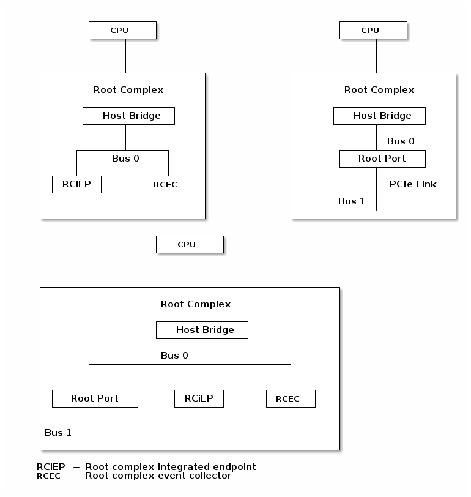

// SPDX-License-Identifier: CC-BY-4.0
//
// riscv-platform-spec.adoc: main file for the specification
//
// This file provides the primary structure and formatting for
// the overall Profile and Platform Specification.
//
= RISC-V Platform Specification
:author: RISC-V Platform Specification Task Group
:email: tech-unixplatformspec@lists.riscv.org
:revnumber: 0.2-rc0
:revdate: Apr 2021
:doctype: book
:sectnums:
:sectnumlevels: 5
:toc: macro
:toclevels: 5

// table of contents
toc::[]

== Introduction 
The platform specification defines a set of platforms that specify requirements
for interoperability between software and hardware. The platform policy 
defines the various terms used in this platform specification. The platform 
policy also provides the needed detail regarding the scope, coverage, naming,
versioning, structure, life cycle and compatibility claims for the platform 
specification. It is recommended that readers get familiar with the platform
policy while reading this specification.

Platforms are augmented with extensions for industry specific target
market verticals like “server”, “mobile”, “edge computing”, “machine-learning”
and “automotive”.

The platform specification currently defines two platforms:

* *OS-A Platform*: This specifies a rich-OS platform for 
Linux/FreeBSD/Windows...flavors that run on enterprise and embedded class 
application processors. +
The OS-A platform has the following extensions:
** *Server Extension*

* *M Platform*: This specifies an RTOS platform for bare-metal applications and 
small operating systems running on a microcontroller. +
The M platform has the following extensions:
** *Physical Memory Protection (PMP) Extension*

// OS-A Platform
== OS-A Platform

=== Terminology
[cols="1,2", width=80%, align="left", options="header"]
|===
|TERM      | DESCRIPTION 
|SBI       | Supervisor Binary Interface    
|UEFI      | Unified Extensible Firmware Interface
|ACPI      | Advanced Configuration and Power Interface
|APEI      | ACPI Platform Error Interfaces 
|SMBIOS    | System Management Basic I/O System
|DTS       | Devicetree source file    
|DTB       | Devicetree binary
|RVA22     | RISC-V Application 2022
|EE        | Execution Environment
|OSPM      | Operating System Power Management
|RV32GC    | RISC-V 32-bit general purpose ISA described as RV32IMAFDC.
|RV64GC    | RISC-V 64-bit general purpose ISA described as RV64IMAFDC.
|RAS       | Reliability, Availability, and Serviceability
|CLINT     | Legacy Core-Local Interrupt Controller
|ACLINT    | Advanced CLINT
|PLIC      | Legacy Platform-Level Interrupt Controller
|APLIC     | Advanced PLIC
|AIA       | Advanced Interrupt Architecture 
|IMSIC     | Incomning MSI Controller
|L1D       | L1 Data cache
|LL	   | Last level cache
|DTLB	   | DATA TLB cache
|PCIe      | PCI Express
|ECAM      | Enhanced Configuration Access Mechanism
|BAR       | Base Address Register
|AER       | Advanced Error Reporting
|CRS       | Configuration Request Retry Status
|TLP       | Transaction Layer Packet
|RCiEP     | Root Complex Integrated Endpoint
|RCEC      | Root Complex Event Collector
|PME       | Power Management Event
|MSI       | Message Signaled Interrupts
|MSI-X     | Enhanced Message Signaled Interrupts
|INTx      | PCIe Legacy Interrupts
|PMA       | Physical Memory Attributes
|PRT       | PCI Routing Table
|ELF       | Executable and Linkable Format
|DWARF     | Debugging With Arbitrary Record Formats
|===

=== Specifications
[cols="1,2", width=80%, align="left", options="header"]
|===
|SPECIFICATION      | VERSION 
|link:https://uefi.org/sites/default/files/resources/UEFI_Spec_2_9_2021_03_18.pdf[UEFI Specification]         | v2.9    
|link:https://github.com/devicetree-org/devicetree-specification/releases/tag/v0.3[Devicetree Specification]  | v0.3
|link:https://github.com/riscv/riscv-sbi-doc/blob/master/riscv-sbi.adoc[SBI Specification]                    | v0.3
|link:[RVA22 Specification]                                                                                   | TBD
|link:https://arm-software.github.io/ebbr/[EBBR Specification]                                                | v2.0.0    
|link:https://uefi.org/sites/default/files/resources/ACPI_Spec_6_4_Jan22.pdf[ACPI Specification]              | v6.4
|link:https://uefi.org/specs/ACPI/6.4/18_ACPI_Platform_Error_Interfaces/ACPI_PLatform_Error_Interfaces.html[APEI Specification]              | v6.4
|link:https://www.dmtf.org/sites/default/files/standards/documents/DSP0134_3.4.0.pdf[SMBIOS Specification]    | v3.4.0
|link:[Platform Policy]                                                                                       | TBD
|link:[RISC-V procedure call standard]                                                                        | TBD
|link:[RISC-V ELF specification]                                                                              | TBD
|link:[RISC-V DWARF specification]                                                                            | TBD
|===

// Base feature set for OS-A Platform
=== Base
==== Architecture
* ISA Requirements
** The OS-A platform is required to comply with the RVA22 profile.
** Within main-memory regions, aligned instruction fetch must be atomic, up to
  the smaller of ILEN and XLEN bits. In particular, if an aligned 4-byte word
  is stored with the `sw` instruction, then any processor attempts to execute
  that word, the processor either fetches the newly stored word, or some previous
  value stored to that location.  (That is, the fetched instruction is not an
  unpredictable value, nor is it a hybrid of the bytes of the old and new
  values.)
** Platforms is allowed to operate only in little-endian mode i.e.
  implementations must hardwire the mstatus.MBE field to 0.

[sidebar]
--
[underline]*_Recommendation_*

User-mode programs should not execute the `fence.i` instruction.

--
* Cache Coherency
** All harts must adhere to the RVWMO memory model.
** All hart PMA regions for main memory must be marked as coherent.
** Memory accesses by I/O masters can be coherent or non-coherent with respect
to all hart-related caches.

==== PMU 

The RVA22 profile defines 32 PMU counters out-of-which first three counters are
defined by the privilege specification while other 29 counters are programmable.
The SBI PMU extension defines a set of hardware events that can be monitored using
these programmable counters. This section defines the minimum number of programmable
counters and hardware events required for an OS-A compatible platform.

* Counters
** The platform do not require to implement any of the programmable counters.
* Events
** The platform do not require to implement any of the hardware events defined
in SBI PMU extensions.

==== Debug
The OS-A base platform requirements are -

- Implement resethaltreq
  * Rationale: Debugging immediately out of reset is a useful debug tool and
    is required by item 5 in chapter 3. The resethaltreq mechanism provides a
    standard way to do this.
- Implement the program buffer
  * Rationale: The program buffer is easier for most implementations than
    abstract access.
  * Rationale: Debuggers need to be able to insert ebreak instructions into
    memory and make sure that the ebreak is visible to subsequent instruction
    fetches.  Abstract access has no support for fence.i (or similar
    mechanisms).
- abstractcs.relaxedpriv must be 0
  * Rationale: Doing otherwise is a potential security problem.
- abstractauto must be implemented
  * Rationale: autoexecprogbuf allows faster instruction-stuffing
  * Rationale: autoexecdata allows fast read/write of a region of memory
- dcsr.mprven must be tied to 1
  * Rationale: Emulating two-stage table walks and PMP checks and endianness
    swapping is a heavy burden on the debugger.
- In textra, sselect must support the value 0 and either value 1 or 2 (or
both).
  * Rationale: There must be some way to limit triggers to only match in a
    particular user context and a way to ignore user context.
- If textra.sselect=1 is supported, the number of implemented bits of svalue
must be at least the number of implemented bits of scontext.
  * Rationale: This allows matching on every possible scontext.
- If textra.sselect=2 is supported, the number of implemented bits of svalue
must be at least ASIDLEN.
  * Rationale: This allows matching on every possible ASID.
- In textra, mhselect must support the value 0.  If the H extension is
supported then mhselect must also support either values 1 and 5 or values 2
and 6 (or all four).
  * Rationale: There must be some way to limit triggers to only match in a
    particular guest context and a way to ignore guest context.
- If textra.mhselect=1,5 are supported and if H is the number of implemented
bits of hcontext then, unless all bits of mhvalue are implemented, at least
H-1 bits of mhvalue must be implemented.
  * Rationale: This allows matching on every possible hcontext (up to the limit
    of the field width).  It is H-1 bits instead of H because mhselect[2]
    provides one bit.
- If textra.mhselect=2,6 are supported, the number of implemented bits of
mhvalue must be at least VMIDLEN-1.
  * Rationale: This allows matching on every possible VMID.  It is VMIDLEN-1
    instead of VMIDLEN because mhselect[2] provides one bit.
- Implement at least four mcontrol6 triggers that can support matching on PC
(select=0, execute=1, match=0) with timing=0 and full support for mode
filtering (vs, vu, m, s, u) for all supported modes and support for textra as
above.
  * Rationale: The debugger needs breakpoints and 4 is a sufficient baseline.
- Implement at least four mcontrol6 triggers that can support matching on load
 and store addresses (select=0, match=0, and all combinations of load/store)
 with timing=0 and full support for mode filtering (vs, vu, m, s, u) for all
 supported modes and support for textra as above.
  * Rationale: The debugger needs watchpoints and 4 is a sufficient baseline.
- Implement at least one trigger capable of icount and support for textra as
above.
  * Rationale: Self-hosted single step needs this
- Implement at least one trigger capable of etrigger and support for textra as
above.
  * Rationale: Debuggers need to be able to catch exceptions.
- Implement at least one trigger capable of itrigger and support for textra as
above.
  * Rationale: Debuggers need to be able to catch interrupts.
- The minimum trigger requirements must be met for action=0 and for action=1
(possibly by the same triggers)
  * Rationale: The intent is to have full support for external debug and full
    support for self-hosted debug (though not necessarily at the same time).
    This can be provided via the same set of triggers or separate sets of
    triggers. External debug support for icount is unnecessary due to dcsr.step
    and is therefore called out separately.
- For implementations with multiple cores, support for at least one halt group
and one resume group (in addition to group 0)
  * Rationale: Allows stopping all harts (approximately) simultaneously which
    is useful for debugging MP software
- dcsr.stepie must support the 0 setting.  It is optional to support the 1
setting.
  * Rationale: It is not generally useful to step into interrupt handlers.
- dcsr.stopcount and dcsr.stoptime must be supported and the reset value of
each must be 1
  * Rationale: The architecture has strict requirements on minstret which may
    be perturbed by an external debugger in a way that's visible to software.
    The default should allow code that's sensitive to these requirements to be
    debugged.

==== Interrupt Controller, Software Interrupt, and Timer Requirements
In the following requirements,
https://github.com/riscv/riscv-aia[*AIA*] refers to the Advanced Interrupt Architecture, https://github.com/riscv/riscv-aclint/blob/main/riscv-aclint.adoc[*ACLINT*]
refers to the Advanced *CLINT*. AIA comprises two separate components: `IMSICs` and `APLICs`. 
If supported, there is an `IMSIC` device associated with each hart. 
If supported, *APLIC* devices are global to all harts, and there may be one or
multiple in a system. *ACLINT* comprises three separate components: `MTIMER` for
Timer support, and `MSWI` and `SSWI` for Machine-level and Supervisor-level
Software Interrupt (IPI) support. +
https://github.com/riscv/riscv-plic-spec/blob/master/riscv-plic.adoc[*PLIC*]
refers to the legacy Platform-Level Interrupt Controller that provides
facilities to route external interrupts to a hart context with a given privilege
mode. The number of non-local interrupt sources supported by PLIC and how does
each of them connect to the hart context is PLIC core implementation-specific. +
*CLINT* is a legacy Core-Local Interrupt Controller that is a compatible subset of
ACLINT which provides facilities to trigger Software (IPI) and Timer interrupts to
hart.

.The following table summarizes what features are supported for four classes of OS/A platforms.
[width="100%",cols="^,^,^,^,^,^,^,^,^,^,^,^,^"]
|=======
.2+|*OS-A Platform* 3+|*MSIs* 3+|*Wired Interrupts* 3+|*IPIs* 3+|*Timer*
|M-level|S-level|VS-level|M-level|S-level|VS-level|M-level|S-level|VS-level|M-level|S-level|VS-level
|Existing|NA|NA|NA|PLIC|PLIC|PLIC + 
_(Trap and emulate)_|MSWI +
https://github.com/riscv/riscv-aclint/blob/main/riscv-aclint.adoc[`*ACLINT*`]|
SBI IPI +
https://github.com/riscv/riscv-sbi-doc[`*SBI*`]|SBI IPI +
https://github.com/riscv/riscv-sbi-doc[`*SBI*`]|MTIMER +
https://github.com/riscv/riscv-aclint/blob/main/riscv-aclint.adoc[`*ACLINT*`]|SBI Timer +
https://github.com/riscv/riscv-sbi-doc[`*SBI*`]|SBI Timer +
https://github.com/riscv/riscv-sbi-doc[`*SBI*`]
|Only Wired IRQs|NA|NA|NA|APLIC M-level +
https://github.com/riscv/riscv-aia[`*AIA*`]|APLIC S-level +
https://github.com/riscv/riscv-aia[`*AIA*`]|APLIC S-level +
_(Trap and emulate)_ +
https://github.com/riscv/riscv-aia[`*AIA*`]|MSWI +
https://github.com/riscv/riscv-aclint/blob/main/riscv-aclint.adoc[`*ACLINT*`]|
SSWI +
https://github.com/riscv/riscv-aclint/blob/main/riscv-aclint.adoc[`*ACLINT*`]|
SBI IPI +
https://github.com/riscv/riscv-sbi-doc[`*SBI*`]|MTIMER +
https://github.com/riscv/riscv-aclint/blob/main/riscv-aclint.adoc[`*ACLINT*`]|
Priv Sstc +
https://github.com/riscv/riscv-isa-manual/releases[`*Priv Spec*`]|
Priv Sstc +
https://github.com/riscv/riscv-isa-manual/releases[`*Priv Spec*`]
|MSIs and Wired IRQs|IMSIC M-level + 
https://github.com/riscv/riscv-aia[`*AIA*`]|IMSIC S-level +
https://github.com/riscv/riscv-aia[`*AIA*`]|APLIC S-level +
_(Trap and emulate)_ +
https://github.com/riscv/riscv-aia[`*AIA*`]|APLIC M-level + 
https://github.com/riscv/riscv-aia[`*AIA*`]|APLIC S-level + 
https://github.com/riscv/riscv-aia[`*AIA*`]|APLIC S-level + 
_(Trap and emulate)_ +
https://github.com/riscv/riscv-aia[`*AIA*`]|IMSIC M-level +
https://github.com/riscv/riscv-aia[`*AIA*`]|IMSIC S-level +
https://github.com/riscv/riscv-aia[`*AIA*`]|SBI IPI +
https://github.com/riscv/riscv-sbi-doc[`*SBI*`]|MTIMER +
https://github.com/riscv/riscv-aclint/blob/main/riscv-aclint.adoc[`*ACLINT*`]|
Priv Sstc +
https://github.com/riscv/riscv-isa-manual/releases[`*Priv Spec*`]|
Priv Sstc +
https://github.com/riscv/riscv-isa-manual/releases[`*Priv Spec*`]
|MSIs, Virtual MSIs and Wired IRQs|IMSIC M-level +
https://github.com/riscv/riscv-aia[`*AIA*`]|IMSIC S-level +
https://github.com/riscv/riscv-aia[`*AIA*`]|APLIC VS-level +
https://github.com/riscv/riscv-aia[`*AIA*`]|APLIC M-level +
https://github.com/riscv/riscv-aia[`*AIA*`]|APLIC S-level +
https://github.com/riscv/riscv-aia[`*AIA*`]|APLIC S-level + 
_(Trap and emulate)_ +
https://github.com/riscv/riscv-aia[`*AIA*`]|IMSIC M-level +
https://github.com/riscv/riscv-aia[`*AIA*`]|IMSIC S-level +
https://github.com/riscv/riscv-aia[`*AIA*`]|IMSIC VS-level +
https://github.com/riscv/riscv-aia[`*AIA*`]|MTIMER +
https://github.com/riscv/riscv-aclint/blob/main/riscv-aclint.adoc[`*ACLINT*`]|
Priv Sstc +
https://github.com/riscv/riscv-isa-manual/releases[`*Priv Spec*`]|
Priv Sstc +
https://github.com/riscv/riscv-isa-manual/releases[`*Priv Spec*`]
|=======

* For Timer support, one or more ACLINT MTIMER devices are Required for OS-A platform.
One MTIMER may be used for all harts, or multiple MTIMERs may be used with
multiple topological groups of harts. The base address of MTIMER memory map registers
is platform implementation-specific, however, the format of MTIMER operation parameters
(`mtime` and `mtimecmp` registers) must be compliant with
https://github.com/riscv/riscv-aclint/blob/main/riscv-aclint.adoc#21-register-map[ACLINT MTIMER Register Map]

* For Interrupt Controller and Software Interrupt support, one of the following three
choices below is Required
  ** PLIC plus one or more ACLINT MSWI devices - DEPRECATED
    *** One MSWI may be used for all harts, or multiple MSWIs may be used with
multiple topological groups of harts
    *** Only wired interrupts and M-mode IPIs are supported
    *** Virtualization is not supported
    *** This compatibly supports legacy PLIC + CLINT designs
  ** One or more AIA APLIC devices plus one or more pairs of ACLINT MSWI and ACLINT SSWI devices
    *** One MSWI/SSWI pair may be used for all harts, or multiple MSWI/SSWI
pairs may be used with multiple topological groups of harts
    *** Only wired interrupts are supported
    *** Both M-mode and S-mode IPIs are supported
    *** Virtualization is not supported
  ** Zero, one, or more AIA APLIC devices plus per-hart AIA IMSIC devices
    *** Both wired and MSI external interrupts are supported
    *** Both M-mode and S-mode IPIs are supported via IMSICs
    *** Virtualization is supported
    *** Zero APLICs if there are no wired interrupts and only MSIs

==== System Peripherals
* UART/Serial Console

In order to facilitate the bringup and debug of the low level initial platform
software(firmware, bootloaders, kernel etc), platforms are required to
implement a UART port which confirms to the following requirements:

* The UART register addresses are required to be aligned to 4 byte boundaries.
If the implemented register width is less than 4 bytes then the implmented
bytes are required to be mapped starting at the smallest address.
* The UART port implementation is required to be register-compatible with one
of the following:
** UART 16550 - _REQUIRED_
** UART 8250 - _DEPRECATED_

* Clock and Timers
** Platforms are required to provide an at least 10ns resolution 64-bit counter
with strictly monotonic updates.
** The hardware clock that drives the counter is required to operate at a minimum
frequency of 10MHz.
** Platforms that use DT for hardware discovery are required to advertise the
timebase to the operating systems via the `timebase-frequency` property of the
"/cpus" node
footnote:[https://elixir.bootlin.com/linux/latest/source/Documentation/devicetree/bindings/riscv/cpus.yaml].

[sidebar]
--
[underline]*_Implementation Note_*

For a counter with 10ns resolution the `timebase-frequency` value would be 100000000
(100 MHz) which would also be the minimum possible value for `timebase-frequency`.
From the software perspective a unit increment of the mtime value would correspond
to a 10ns interval. However the hardware clock driving the counter could operate at a
lower frequency, thereby incrementing the mtime value by more than one unit per
clock tick.
--
==== Boot Process
- The base specification defines the interface between the firmware and the 
operating system suitable for the RISC-V platforms with rich operating 
systems.
- These requirements specify the required boot and runtime services, device 
discovery mechanism, etc. 
- The requirements are operating system agnostic, specific firmware/bootloader
implementation agnostic.
- Any RV32GC or RV64GC platform seeking compatibility with the base 
specification is required to implement all three privilege modes i.e. M, S and
U mode.
- For the generic mandatory requirements this base specification will refer to
the EBBR Specification. Any deviation from the EBBR will be explicitly 
mentioned in the requirements.
- Specifications followed are mentioned in the  
<<Specifications,Specification Section>>

===== Firmware
====== Storage and Partitioning
- GPT partitioning required for shared storage.
- MBR support is not required

===== Discovery Mechanisms 
- Device Tree (DT) is the required mechanism for system description.
- Compliance with the System Description Specification is required – TBD

==== Runtime Services
===== SBI

- Required SBI spec version is 0.3 or higher.
- Required SBI extensions -

[cols="1,2", width=80%, align="left", options="header"]
|===
|EXTENSION     |    CONDITIONS 
|SBI TIME      |    if **stimecmp** CSR not available
|SBI IPI       | 
|SBI RFENCE    | 
|SBI HSM       | 
|SBI SRST      |    
|SBI PMU       | 
|===

- Required responsibilities of M-Mode runtime also includes - 
    ** Interrupt and Exception Delegation
    ** Misaligned Load & Stores handling
    ** Missing CSRs emulation 
    ** PMP Configuration

- Wherever applicable firmware must implement UEFI interfaces over similar 
interfaces and services present in the SBI specification. For example, UEFI 
runtime services must implement ResetSystem() via SBI Reset extension. 

===== UEFI
- OS should prioritize calling the UEFI interfaces before the SBI or Platform 
specific mechanisms.

==== Software and ABIs
The platform specification mandates the following requirements for software components:

* All RISC-V software components must comply with the `RISC-V procedure call standard`.
* All RISC-V software components that use ELF files must comply with the `RISC-V ELF specification`.
* All RISC-V software components that use DWARF files must comply with the `RISC-V DWARF specification`.

Rationale: The platform specification intends to avoid fragmentation and promotes interoperability.

// Server extension for OS-A Platform
=== Server Extension
The server extension specifies additional requirements for RV64I based server 
class platforms. The server extension includes all of the requirements for the
base with the additional requirements as below.

==== Architecture
The platforms which conform to server extension are required to implement +

- RV64 support
- RISC-V H ISA extension
- VMID support

==== PMU

* Counters
** The platform must implement at least 8 programmable counters.
* Events
** Hardware general events
*** The platform must implement all of the general hardware events defined by
the SBI PMU extension.
** Hardware cache events
*** The platform must implement all of the hardware cache events for READ operations
while WRITE operation must be implemented for L1D, LL and DTLB caches.

[sidebar]
--
[underline]*_Implementation Note_*

Any platform that do not implement the micro-architectural features related to
a hardware event may hardwire the event value to zero.
--

==== Debug
The OS-A server platform requirements are all of the base above plus:

- Implement at least six mcontrol6 triggers that can support matching on PC
(select=0, execute=1, match=0) with timing=0 and full support for mode
filtering (vs, vu, m, s, u) for all supported modes and support for textra as
above.
  * Rationale: Other architectures have found that 4 breakpoints are
    insufficient in more capable systems and recommend 6.
- If system bus access is implemented then accesses must be coherent with
respect to all harts connected to the DM
  * Rationale: Debuggers must be able to view memory coherently

==== Interrupt Controller 

==== Boot and Runtime Requirements
=====  Firmware
The boot and system firmware for the RV64I server platforms required to be
based on UEFI as per the base specification with some additional
requirements as mentioned below.

====== PCIe support
The platforms are required to implement *EFI_PCI_ROOT_BRIDGE_IO_PROTOCOL* and other
protocols as specified in Chapter 14 of UEFI specification version 2.9.

====== UEFI configuration tables
The platforms are required to provide following tables.

* *EFI_ACPI_20_TABLE_GUID* ACPI configuration table which is at version 6.4+ or
newer with HW-Reduced ACPI model.
* *SMBIOS3_TABLE_GUID* SMBIOS table which conforms to version 3.4 or later.

====== UEFI Protocol support
The UEFI protocols listed below are required to be implemented in addition to
the base spec requirements.

.Required UEFI Protocols
[cols="3,1,1", width=95%, align="center", options="header"]
|===
|Protocol                              | UEFI Section | Note
|EFI_LOAD_FILE2_PROTOCOL               | 13.2       |
|EFI_DECOMPRESS_PROTOCOL               | 19.5       |
|===

===== Hardware Discovery Mechanisms

====== ACPI

For RV64I server platforms, ACPI tables are required to be passed via UEFI
to the operating system for the purpose of discovery and the configuration of
the hardware. This section defines the required ACPI tables and objects. All
other ACPI tables for RISC-V can be implemented as needed adhering to the ACPI
spec version 6.4+(RISC-V support when added).

In ACPI namespace, processors are required to be defined under the System Bus
*(\_SB)* name space.

The required ACPI System Description Tables, Device Objects and Methods are
listed below.

.Required ACPI System Description Tables
[cols="3,2,2", width=95%, align="center", options="header"]
|===
|ACPI Table                                    |ACPI Section|Note
|Root System Description Pointer (RSDP)        |5.2.5      |
|Extended System Description Table (XSDT)      |5.2.8      |
|Fixed ACPI Description Table (FADT)           |5.2.9      |
|Differentiated System Description Table (DSDT)|5.2.11.1   |
|Multiple APIC Description Table (MADT)        |5.2.12     |
|RISC-V Timer Description Table                |           |timebase-frequency
|Processor Properties Topology Table (PPTT)    |5.2.29     |CPU and Cache 
                                                            topology
                                                            information
|Memory-mapped Configuration space (MCFG)      |See Links to ACPI-Related 
                                                Documents (http://uefi.org/acpi)
                                                under the heading 
                                                "PCI Sig”       |Required for PCIe
                                                            support
|Debug Port Table 2 (DBG2)                     |See Links to ACPI-Related 
                                                Documents (http://uefi.org/acpi)
                                                under the heading 
                                                “Debug Port Table 2” |
|Serial Port Console Redirection (SPCR)        |See Links to ACPI-Related 
                                                Documents (http://uefi.org/acpi)
                                                under the heading 
                                                “Serial Port Console 
                                                Redirection Table” |
|System Resource Affinity Table (SRAT)         |5.2.16     |Required if the
                                                            platform supports 
                                                            NUMA
|System Locality Information Table (SLIT)      |5.2.17     |Required if the
                                                            platform supports 
                                                            NUMA
|IOMMU Information Table                       |           |IOMMU table 
                                                            (like IVRS)
|Software Delegated Exception Interface (SDEI) |See Links to ACPI-Related 
                                                Documents (http://uefi.org/acpi)
                                                under the heading 
                                                "Software Delegated Exceptions
                                                Interface”       |
|PMU event mapping table                       |          |
|===

.Required Device Objects and Methods
[cols="1,2,3", width=95%, align="center", options="header"]
|===
|Object/Method | ACPI Section | Note
|_AEI          | 5.6.5.2     | Required for GPIO-signalled events
|_EVT          | 5.6.5.3     | Required for interrupt-signalled events
|_ADR          | 6.1.1       | Required for PCI
|_HID          | 6.1.5       |
|_UID          | 6.1.12      |
|_CRS          | 6.2.2       |
|_CCA          | 6.2.17      | Required for DMA capable devices
|_STA          | 6.3.7/7.2.4 | Device status
|===

====== SMBIOS

The System Management BIOS (SMBIOS) table is required for the platform
conforming to server extension. The SMBIOS records provide basic hardware and
firmware configuration information used widely by the platform management
applications.

The SMBIOS table is identified using *SMBIOS3_TABLE_GUID* in UEFI configuration
table. The memory type used for the SMBIOS table is required to be of type
*EfiRuntimeServicesData*.

In addition to the conformance guidelines as mentioned in *ANNEX A / 6.2* of
the SMBIOS specification 3.4.0, below additional structures are required.

.Required SMBIOS structures
[cols="3,2,2", width=95%, align="center", options="header"]
|===
|Structure Type                                 | SMBIOS Section | Note
|Management Controller Host Interface (Type 42) | 7.43           | Required for
Redfish Host Interface.
|Processor Additional Information (Type 44)     | 7.45           | This
structure provides the additional information of RISC-V processor
characteristics and HART hardware features discovered during the firmware boot
process.
|===

===== Runtime services
====== SBI
*TBD*

====== UEFI
The UEFI run time services listed below are required to be implemented.

.Required UEFI Runtime Services
[cols="3,2,3", width=95%, align="center", options="header"]
|===
|Service                   | UEFI Section | Note
|GetVariable               | 8.2        |
|GetNextVariableName       | 8.2        |
|SetVariable               | 8.2        | A dedicated storage for firmware is
required so that there is no conflict in access by both firmware and the OS.
|QueryVariableInfo         | 8.2        |
|GetTime                   | 8.3        | System Real-time accessed by the
OS and firmware.<<SystemRealTime,(Refer to System Real-time section)>>
|SetTime                   | 8.3        | System Real-time set by the
OS and firmware.<<SystemRealTime,(Refer to System Real-time section)>>
|GetWakeupTime             | 8.3        | Interface is required to be
implemented but it can return EFI_UNSUPPORTED.<<SystemRealTime,(Refer to
System Real-time section)>>
|SetWakeupTime             | 8.3        | Interface is required to be
implemented but it can return EFI_UNSUPPORTED.<<SystemRealTime,(Refer to
System Real-time section)>>
|SetVirtualAddressMap      | 8.4        |
|ConvertPointer            | 8.4        |
|GetNextHighMonotonicCount | 8.5        |
|ResetSystem               | 8.5        | If SBI SRST implementation is
also available, the OS should not use the SBI interface directly but use this
UEFI interface.
|UpdateCapsule             | 8.5        | Interface is required to be
implemented but it can return EFI_UNSUPPORTED.
|QueryCapsuleCapabilities  | 8.5        | Interface is required to be
implemented but it can return EFI_UNSUPPORTED.
|===

==== System Peripherals
===== Clock and Timers
** Platforms are required to implement the time CSR.
** Platforms are required to implement the
https://lists.riscv.org/g/tech-privileged/message/404[Sstc] extension.
** Platforms are required to delegate the supervisor timer interrupt to 'S'
mode. If the 'H' extension is implemented then the platforms are required to
delegate the virtual supervisor timer interrupt to 'VS' mode.

===== Watchdog Timers
Implementation of a two-stage watchdog timer, as defined in the WatchDog Timer
appendix footnote:[Watchdog Timer Appendix (TBD)] ,is required. Software must
periodically refresh the watchdog timer, otherwise a first-stage watchdog
timeout occurs. If the watchdog timer remains un-refreshed for a second period,
then a second-stage watchdog timeout occurs.

If a first-stage watchdog timeout occurs, a Supervisor-level interrupt request
is generated and sent to the system interrupt controller, targeting a specific
hart.

If a second-stage watchdog timeout occurs, a system-level interrupt request is
generated and sent to a system component more privileged than Supervisor-mode
such as:

- The system interrupt controller, with a Machine-level interrupt request
targeting a specific hart
- A platform management processor
- Dedicated reset control logic

The resultant action taken is platform-specific.

===== System Real-time[[SystemRealTime]]
In order to facilitate server manageability, server extension platform is
required to provide the mechanism to maintain system date and time. The
mechanism could be the Real-time clock on platform as it mentioned in UEFI
spec, or other implementations that can provide the date and time information
to UEFI runtime Time service. +
The GetTime() and SetTime() UEFI runtime service
must be implemented by firmware to incorporate with the underlying system 
Real-time mechanism, however the SetTime() is allowed to be unsupported if the
platform doesn’t require the feature to set date and time or the system
Real-time mechanism doesn’t have capability to set time. UEFI GetWakeupTime()
and SetWakeupTime() runtime services are also required to be implemented on
server extension platform. However, those two runtime services can return
EFI_UNSUPPORTED to the caller if the wake up from time is not supported by the
platform. +
Timezone and Daylight Saving Time (DST) are also defined in UEFI runtime Time
service, however the system Real-time mechanism may not have the capability
to maintain this information. Firmware can always return the local time without
timezone and DST information, or firmware incorporates with other facilities
such as BMC, UEFI variable or boot time system configuration utility to
maintain this information with the system Real-time mechanism.

===== PCIe
Platforms are required to support at least PCIe Base Specification Revision 1.1
footnote:[https://pcisig.com/specifications].

====== PCIe Config Space
* Platforms shall support access to the PCIe config space via ECAM as described
in the PCIe Base specification.
* The entire config space for a single PCIe domain should be accessible via a
single ECAM I/O region.
* Platform firmware should implement the MCFG table as listed in the ACPI System
Description Tables above to allow the operating systems to discover the supported
PCIe domains and map the ECAM I/O region for each domain.
* Platform software shall configure ECAM I/O regions such that the effective
memory attributes are that of a PMA I/O region (i.e. strongly-ordered,
non-cacheable, non-idempotent).

====== PCIe Memory Space
Platforms are required to map PCIe address space directly in the system address
space and not have any address translation for outbound accesses from harts or
for inbound accesses to any component in the system address space

* PCIe Outbound Memory +
PCIe devices and bridges/switches frequently implement BARs which only support
32-bit addressing or support 64 bit addressing but do not support prefetchable
memory. To support mapping of such BARs, platforms are required to reserve
some space below 4G for each root port present in the system.

[sidebar]
--
[underline]*_Implementation Note_* +
Platform software would likely configure these per root port regions such that
their effective memory attributes are that of a PMA I/O region (i.e.
strongly-ordered, non-cacheable, non-idempotent). Platforms would likely also
reserve some space above 4G to map BARs that support 64 bit addressing and
prefetchable memory which could be configured by the platform software as either
I/O or memory.
--

* PCIe Inbound Memory +
For security reasons, platforms must provide a mechanism controlled by M-mode
software to restrict inbound PCIe accesses from accessing regions of address
space intended to be accessible only to M-mode software.

[sidebar]
--
[underline]*_Implementation Note_* +
Such an access control mechanism could be analogous to the per-hart PMP
as described in the RISC-V Privileged Architectures specification.
--

====== PCIe Interrupts
* Platforms shall support both INTx and MSI/MSI-x interrupts.
* Following are the requirements for INTx:
** For each root port in the system, the platform shall map all the INTx
virtual wires to four distinct sources at the APLIC. Each of these sources
shall be configured as Level0 as described in Table 4.2 (Encoding of the SM
(Source Mode) field) of the RISC V AIA specification.
** Platform firmware shall implement the _PRT as described in section 6.2.13 of
ACPI Specification to describe the mapping of interrupt pins and the
corresponding interrupt minor identities at the Hart.
** If interrupt generation for correctable/fatal/non-fatal error messages is
enabled via the root error command register of the AER capability and the root
port does not support MSI/MSI-X capability, then the platform is required to
generate an INTx interrupt via the APLIC.
* Following are the requirements for MSI:
** As per the RISC V AIA specification since the number 0 is not a valid
interrupt identity, the platform software is required to ensure that MSI data
value assigned to a PCIe function is never 0. For e.g for a PCIe function which
requests 16 MSI vectors the minimum MSI data value assigned by the platform
software can be 0x10 so that the function can use lower 4 bits to assert each
of the 16 vectors.

====== PCIe cache coherency
Memory that is cacheable by harts is not kept coherent by hardware when PCIe
transactions to that memory are marked with a No_Snoop bit of zero. In this
case, software shall manage coherency on such memory; otherwise, software
coherency management is not required.

====== PCIe Topology
Platforms are required to implement at least one of the following topologies
and the components required in that topology.

[#fig_intro1]
.PCIe Topologies

* Host Bridge +
Following are the requirements for host bridges:

** Any read or write access by a hart to an ECAM I/O region shall be converted
by the host bridge into the corresponding PCIe config read or config write
request.
** Any read or write access by a hart to a PCIe outbound region shall be
forwarded by the host bridge to a BAR or prefetch/non-prefetch memory window,
if the address falls within the region claimed by the BAR or prefetch/
non-prefetch memory window. Otherwise the host bridge shall return an error.

** Host bridge shall return all 1s in the following cases:
*** Config read to non existent functions and devices on root bus.
*** Config reads that receive Unsupported Request response from functions and
devices on the root bus.
* Root ports +
Following are the requirements for root ports.
** Root ports shall appear as PCI-PCI bridge to software.
** Root ports shall implement all registers of Type 1 header.
** Root ports shall implement all capabilities specified in the PCIe Base
specification for a root port.
** Root ports shall forward type 1 configuration access when the bus number in
the TLP is greater than the root port's secondary bus number and less than or
equal to the root port's subordinate bus number.
** Root ports shall convert type 1 configuration access to a type 0
configuration access when bus number in the TLP is equal to the root port's
secondary bus number.
** Root ports shall respond to any type 0 configuration accesses it receives.
** Root ports shall forward memory accesses targeting its prefetch/non-prefetch
memory windows to downstream components. If address of the transaction does not
fall within the regions claimed by prefetch/non-prefetch memory windows then
the root port shall generate a Unsupported Request.
** Root port requester id or completer id shall be formed using the bdf of the
root port.
** The root ports shall support the CRS software visibility.
** The root port shall implement the AER capability.
** Root ports shall return all 1s in the following cases:
*** Config read to non existent functions and devices on secondary bus.
*** Config reads that receive Unsupported Request from downstream components.
*** Config read when root port's link is down.

* RCiEP +
All the requirements for RCiEP in the PCIe Base specification shall be
implemented.
In addition the following requirements shall be met:
** If RCiEP is implemented then RCEC shall be implemented as well. All
requirements for RCEC specified in the PCIe Base specification shall be
implemented. RCEC is required to terminate the AER and PME messages from RCiEP.
** If both the topologies mentioned above are supported then RCiEP and RCEC
shall be implemented in a separate PCIe domain and shall be addressable via a
separate ECAM I/O region.

===== PCIe Device Firmware Requirement
PCI expansion ROM code type 3 (UEFI) image must be provided by PCIe device for
OS/A server extension platform according to
https://pcisig.com/specifications/conventional/pci_firmware[PCI Firmware Specification Revision 3.3]
if that PCIe device is utilized during UEFI firmware boot process. The image
stored in PCI expansion ROM is an UEFI driver that must be compliant with
https://uefi.org/specifications[UEFI specification 2.9] 14.4.2 PCI Option ROMs.

==== Secure Boot
* TEE
* Root of Trust
* E-Fuse
* PKA/TRNG

==== RAS
All the below mentioned RAS features are required for the OS-A platform server
extension

*  Main memory must be protected with SECDED-ECC. +
*  All cache structures must be protected. +
** single-bit errors must be detected and corrected. +
** multi-bit errors can be detected and reported. +
* There must be memory-mapped RAS registers associated with these protected
structures to log detected errors with information about the type and location
of the error. +
* The platform must support the APEI specification to convey all error
information to OSPM. +
* Correctable errors must be reported by hardware and either be corrected or
recovered by hardware, transparent to system operation and to software. +
* Hardware must provide status of these correctable errors via RAS registers. +
* Uncorrectable errors must be reported by the hardware via RAS error
registers for system software to take the needed corrective action. +
* Attempted use of corrupted (uncorrectable) data must result in a precise
exception on that instruction with a distinguishing custom exception cause
code. +
* The platform should provide the capability to configure each RAS
error to trigger firmware-first or OS-first error interrupt. +
* Errors logged in RAS registers must be able to generate an interrupt request
to the system interrupt controller that may be directed to either M-mode or
S/HS-mode for firmware-first or OS-first error reporting. +
* If the RAS error is handled by firmware, the firmware should be able
to choose to expose the error to S/HS mode for further processing or
just hide the error from S/HS software. +
* If the RAS event is configured as the firmware first model, the platform 
should be able to trigger the higest priority of M-mode interrupt to all HARTs 
in the physical RV processor. +
* Logging and/or reporting of errors can be masked. +
* PCIe AER capability is required. +

==== Interrupt Controller, Software Interrupt, and Timer Requirements
  * For Timer support, ACLINT MTIMER devices is/are Required
  * For Interrupt Controller and Software Interrupt support, the following one choice is Required
    - Zero, one, or more AIA APLIC devices plus per-hart AIA IMSIC devices

// M Platform
== M Platform 

=== Scope
The M Platform specification aims to apply to a range of embedded platforms.
In this case embedded platforms range from hand coded bare metal assembly
all the way to to embedded operating systems such as
https://www.zephyrproject.org[Zephyr] and embedded Linux.

This specification has two competing interests. On one hand embedded software
will be easier to write and port if all the embedded hardware is similar. On
the other hand vendors want to differentiate their product and reuse existing
IP and SoC designs.

Due to this, the M Platform specification has both required and recommended
components. All required components must be met in order to meet this
specification.
It's strongly encouraged that all recommended components are met as well,
although they do not have to in order to meet the specification.

=== Base
==== Architecture
The M Platform specification depends on the RVM22 specification and all
requirements from RVM22 must be met.

Any RISC-V system that uses at least RV32/64G can meet the M Platform
specification.

==== Interrupt Controller
Embedded systems are recommended to use a spec compliant
https://github.com/riscv/riscv-plic-spec[PLIC], a spec compliant
https://github.com/riscv/riscv-fast-interrupt/blob/master/clic.adoc[CLIC]
or both a CLIC and and PLIC.

If using just a PLIC the system must continue to use the original basic
`xsip`/`xtip`/`xeip` signals in the `xip` register to indicate pending
interrupts.
If using the CLIC then both the original basic and CLIC modes of interrupts
must be supported.

Embedded systems cannot use a non-compliant interrupt controller and still
call it a PLIC or CLIC.

==== Machine Timer
The RISC-V machine timer (controlled via `mtime` and `mtimecmp`) must be
implemented. The two registers must be memory mapped as required by the RISC-V
specification.

The M Platform specification requires that the registers be mapped
adjacent to each other with the `mtime` region at the lower address.

The starting address of this region can be located anywhere in
memory, including inside other peripherals, as long as the start address is
4 byte aligned.

An example of the memory layout for a 32-bit system with a single hart is below

-------------------------
=========================
| 0x00 |  mtime low     |
| 0x04 |  mtime high    |
| 0x08 |  mtimecmp low  |
| 0x0C |  mtimecmp high |
=========================
-------------------------

and for a 64-bit system with 2 harts

---------------------------
===========================
| 0x00 |  mtime           |
| 0x08 |  mtimecmp hart 1 |
| 0x10 |  mtimecmp hart 2 |
===========================
---------------------------

The `mcounteren`.TM and `scounteren`.TM bits _must not_ be hardwired,
regardless as to whether accesses to the `time` CSR are implemented
directly or via traps.

==== Memory Map
It is recommended that main memory and loadable code (not ROM) start at
address `0x8000_0000`.

// PMP extension for M Platform
=== Physical Memory Protection (PMP) Extension
It is recommended that any systems that implement more then just machine mode
also implement PMP support.

When PMP is supported it is recommended to include at least 4 regions, although
if possible more should be supported to allow more flexibility. Hardware
implementations should aim for supporting at least 16 PMP regions.
